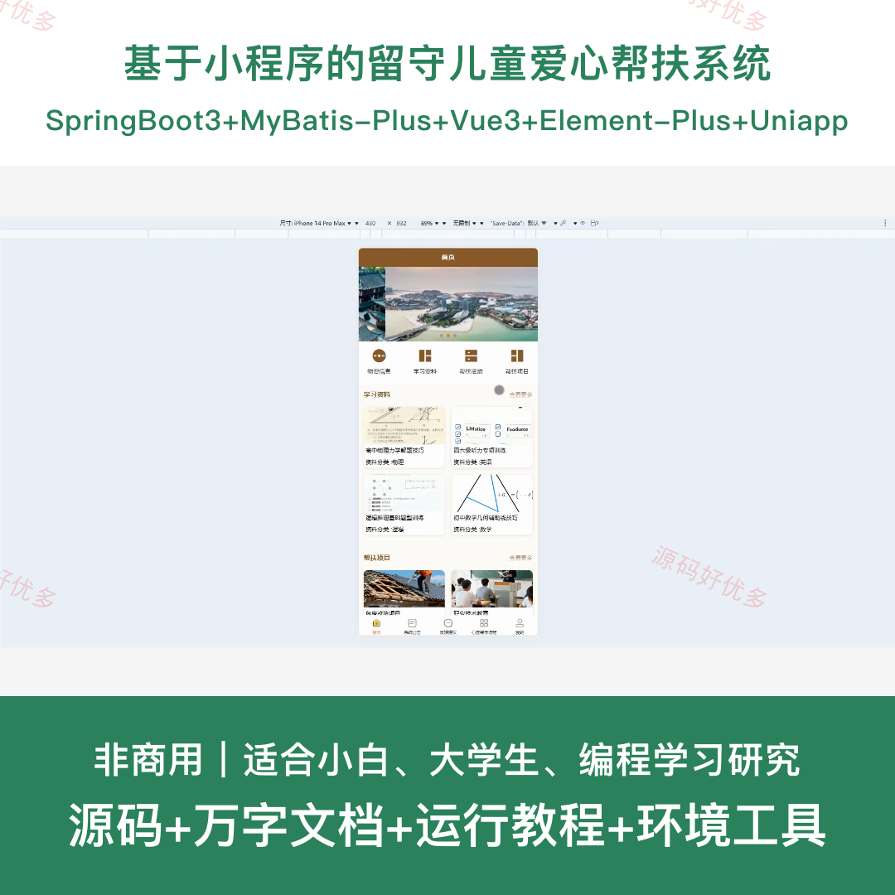
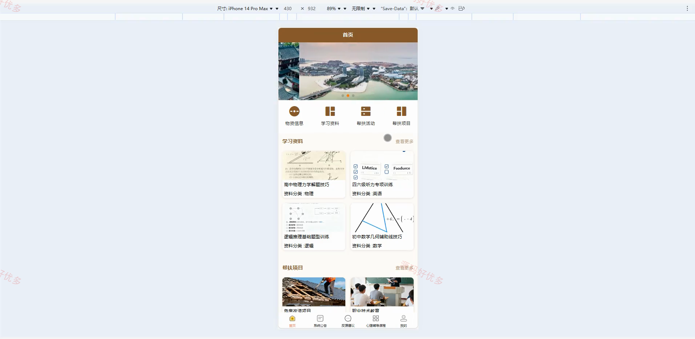
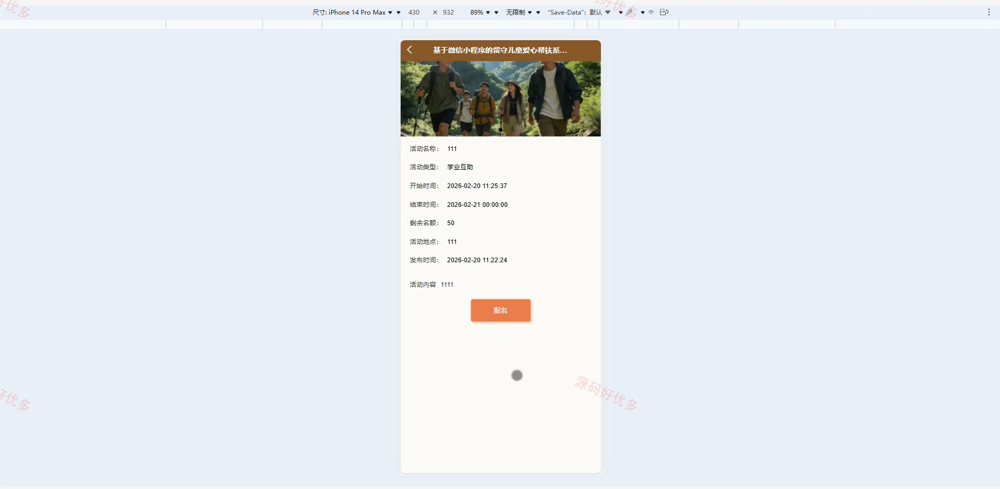
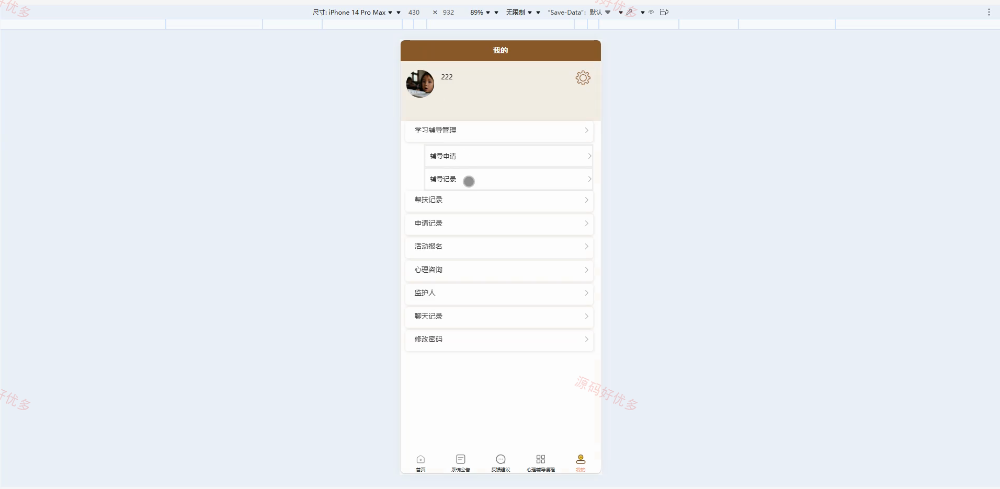
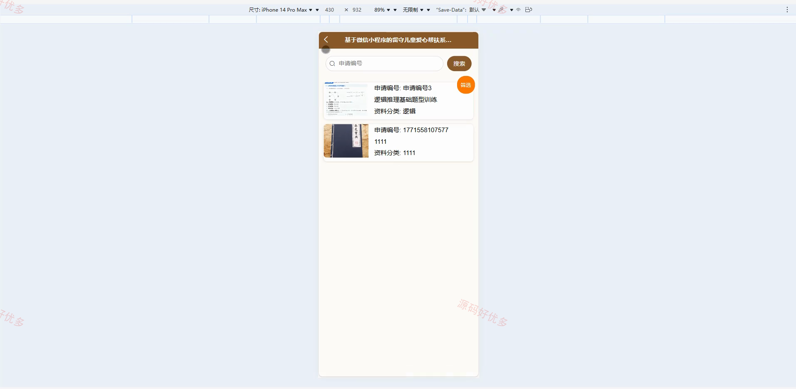
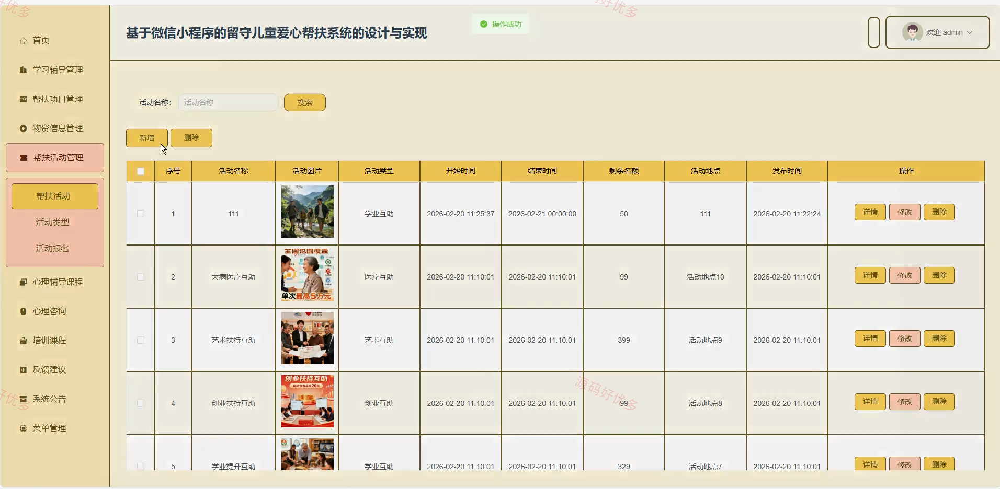
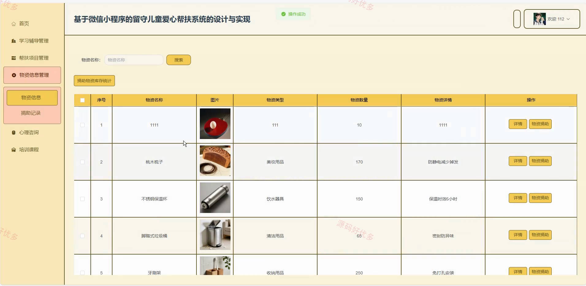
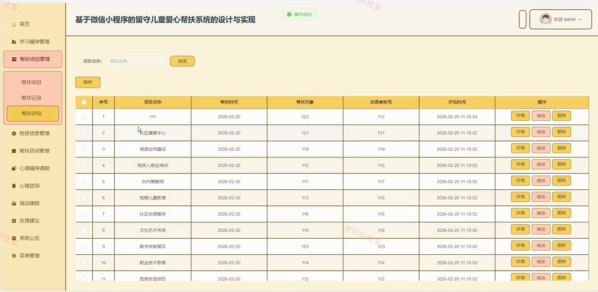
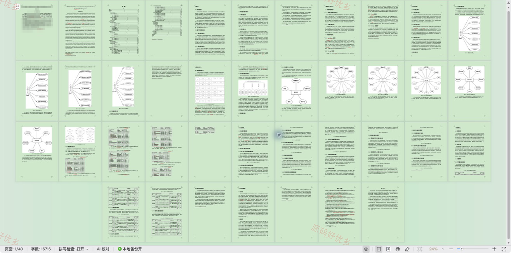

# mpweixinA271D-
mpweixinA271D 基于微信小程序的留守儿童爱心帮扶系统
## 源码问题查看主页咨询

### 一、关键词
微信小程序、留守儿童爱心帮扶系统、留守儿童爱心帮扶、留守儿童爱心帮扶信息管理、留守儿童爱心帮扶后台管理

### 二、作品包含
源码+数据库+万字设计文档+全套环境和工具资源+本地部署教程

### 三、项目技术
前端技术： Html、Css、Js、Vue3.5、Element-Plus、uniapp
后端技术：Java、SpringBoot3.3.0、MyBatis-Plus

### 四、运行环境（以下版本亲测，其他版本兼容性请自行测试）
开发工具：IDEA/eclipse + VSCODE + HBuilder X + 微信开发者工具

数据库：MySQL8.0+（共27张表）

数据库管理工具：Navicat10以上版本

环境配置软件： JDK17 + Maven3.6.3

前端Nodejs：16+

浏览器：谷歌浏览器

### 五、项目介绍
项目编号：mpweixinA271D

基于微信小程序的留守儿童爱心帮扶系统面向留守儿童、志愿者、监护人、管理员，提供反馈建议管理、物资信息查看、物资信息物资申请、学习资料查看、学习资料申请辅导、帮扶活动查看、帮扶活动报名等功能，实现各角色在系统中的实际业务协作。

角色：留守儿童、志愿者、监护人、管理员

留守儿童功能：前台登录与注册、反馈建议管理、物资信息查看与申请、学习资料查看与申请辅导、帮扶活动查看与报名、帮扶项目查看。

志愿者功能：后台登录与注册、辅导申请与辅导学习、辅导记录查看与私信、帮扶项目查看与帮扶记录、帮扶评估查看、物资捐助与捐助记录查看、心理咨询查看与私信、培训课程查看。

监护人功能：前台登录与注册、反馈建议管理、物资信息查看与申请、学习资料查看与申请辅导、帮扶活动查看与报名、帮扶项目查看。

管理员功能：后台登录、学习辅导管理、帮扶项目管理、物资信息管理、帮扶活动管理、心理辅导与咨询管理、培训课程管理、反馈建议与系统公告管理。

### 六、运行截图

